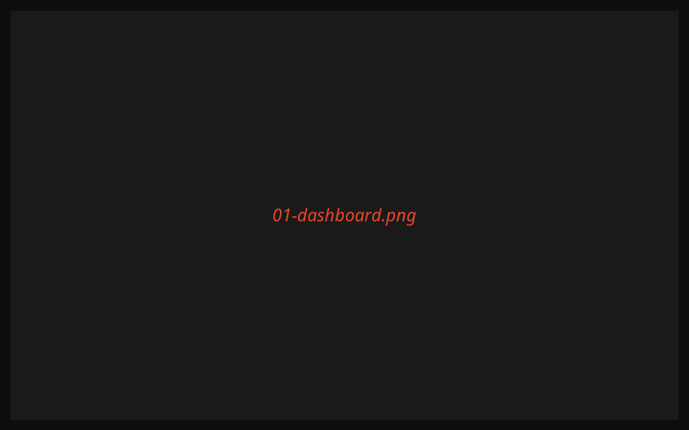
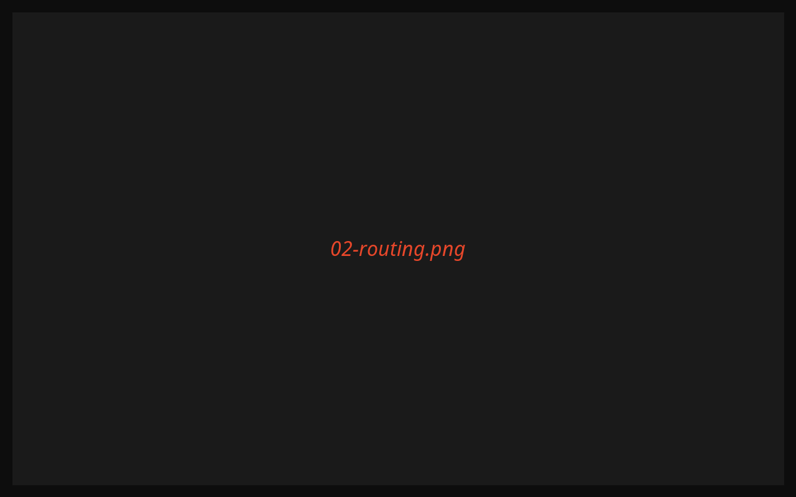
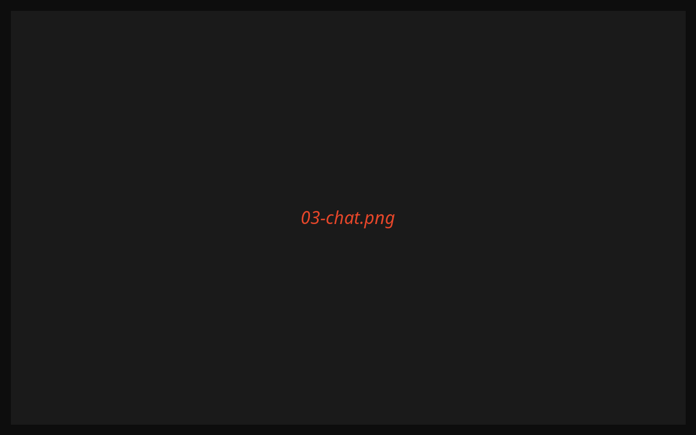
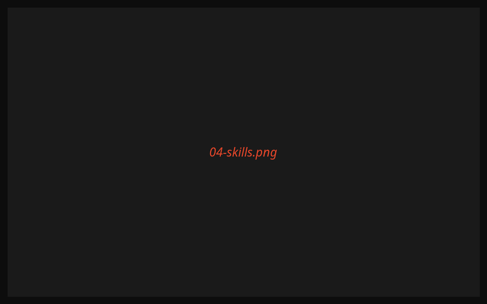
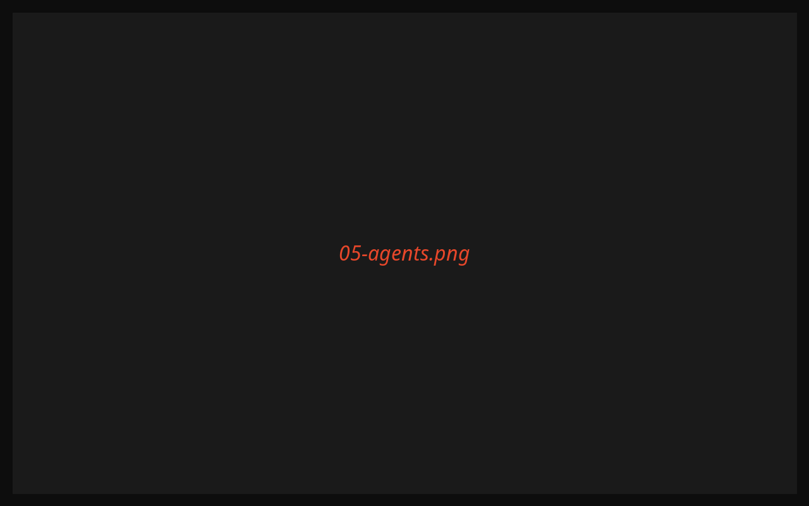
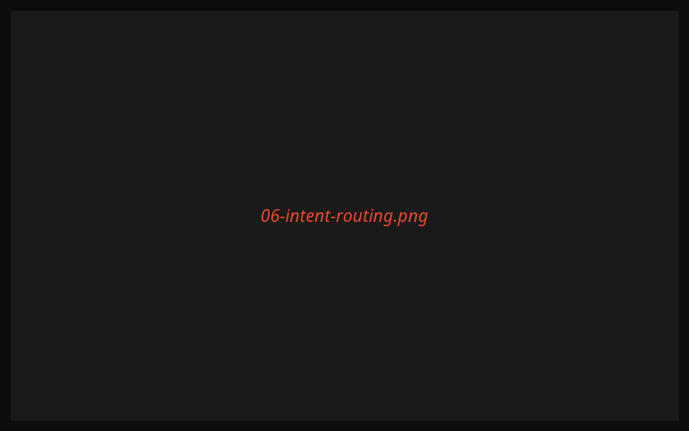

# ClawControl

**Production-grade monitoring and control dashboard for the [OpenClaw](https://openclaw.ai) AI gateway.**

ClawControl gives you a single, self-hosted interface to observe, control, and interact with your OpenClaw setup — real-time metrics, multi-model routing, a full chat client, agent management, and more. It runs entirely on your machine alongside OpenClaw and requires no external services beyond your existing OpenRouter API key.

---

## Screenshots

| | |
|---|---|
|  |  |
| **Mission Control** — live metrics, gateway status, credit balance | **Routing** — primary model, fallbacks, manual override, intent rules |
|  |  |
| **Chat** — SSE streaming, vision upload, live latency counter | **Skills Manager** — browse and inspect installed OpenClaw skills |
|  |  |
| **Agents Factory** — fleet, orders, cron scheduler | **Intent-Aware Routing** — rule-based model routing by message type |

> _Replace placeholder images with actual screenshots once running locally._

---

## Features

### Real-Time Observability
- Live hardware metrics (CPU, RAM, disk, network) streamed over WebSocket
- Gateway status, uptime, and health probe with per-model auth checks
- Credit balance monitoring with configurable alert thresholds
- Activity feed and recent request history on the Mission Control overview

### Multi-Model Routing
- **Primary + fallback chain** — configure up to N fallback models; OpenClaw cascades automatically on failure
- **Manual override** — force a specific model for N requests, then revert to auto-routing
- **Intent-aware routing** — rule-based classifier routes messages before they hit the gateway:
  - Image attachments → vision model (e.g. Qwen)
  - Code fences / keywords → code model (e.g. Codex)
  - Short routine messages → fast/cheap model (e.g. gpt-oss-20b)
  - Zero latency overhead — pure rule evaluation, no pre-call LLM
- **Model Health Indicators** — live auth status per configured model
- All routing config editable in the UI; persisted to `~/.openclaw/clawcontrol.json`

### Chat
- Full SSE streaming chat client routed through OpenClaw → OpenRouter
- **Vision & document upload** — drag-and-drop or paste images; attach PDFs, `.txt`, `.md`, `.csv`
- Per-response model label, tier badge, and failover indicator
- **Live latency counter** — ticking timer starts on send, freezes to server-reported latency on completion
- Model override selector per session — switch models mid-conversation
- Session history with rename, pin, and delete; persists across page reloads
- Markdown rendering with syntax-highlighted code blocks
- Per-response metadata drawer: request ID, tokens, cost, latency, finish reason

### Agents Factory
- **Fleet management** — configure your primary OpenClaw agent (model, workspace, compaction, concurrency) and create custom named agents
- **Orders** — send directives to any agent; full order history with expand/collapse
- **Cron scheduler** — create scheduled jobs with preset or custom cron expressions; toggle, edit, delete

### Prompts & Templates
- Saved prompt library with category filters and `{{variable}}` interpolation
- Fill & Send / Send Raw actions dispatched directly to chat
- Template editor with live Markdown preview; export to `~/.openclaw/` files
- Built-in starters: `SKILL.md`, `README.md`, `SYSTEM_PROMPT.md`

### Skills Manager
- Browse all installed OpenClaw skills with lazy-loaded `SKILL.md` content
- Expandable cards per skill

### Credentials & Keys
- View and manage all API keys stored in OpenClaw config
- **Cost circuit breaker** — configurable daily burn ceiling; alerts when spend approaches limit
- Credit balance display with configurable low-balance alerts

### Observability Hub (Logs)
- Journald log explorer with level filter, keyword search, time range, and live tail
- Config audit log tab
- One-click jump from a chat response's metadata drawer to the corresponding log entry
- CSV export

### Alerts
- Six automated checks: gateway offline, probe failed, model health degraded, error spike, update available, credit balance low
- Dismissed alerts persisted to localStorage; badge count always visible in nav

### Quality of Life
- **Auto-login for localhost** — no password prompt when accessing from `127.0.0.1`
- **PWA installable** — install as a desktop app from Chrome or Edge
- Collapsible sidebar with keyboard-friendly navigation
- Debug panel with live WebSocket event log
- ARIA labels, focus-visible outlines, and live regions throughout

---

## Requirements

| Dependency | Version |
|---|---|
| [OpenClaw](https://openclaw.ai) | Any recent version |
| Python | 3.10+ (3.12 recommended) |
| Node.js | 18+ (22 recommended) |
| OpenRouter API key | Required for chat |

OpenClaw must be installed and running before starting ClawControl. ClawControl reads OpenClaw's config at `~/.openclaw/openclaw.json` and writes its own extensions to `~/.openclaw/clawcontrol.json`.

---

## Quick Start

### 1. Clone

```bash
git clone https://github.com/VSG-repo/clawcontrol.git
cd clawcontrol
```

### 2. Configure the backend

```bash
cp backend/.env.example backend/.env
```

Edit `backend/.env`:

```env
WAGZ_PASSWORD=your_dashboard_password

OPENCLAW_HOST=localhost
OPENCLAW_PORT=18789
CREDIT_ALERT_FLOOR=5.0
DAILY_BURN_CEILING=10.0
CPU_TEMP_THRESHOLD=85
```

Your `OPENROUTER_API_KEY` is read directly from OpenClaw's config at runtime — no need to set it here.

### 3. Install dependencies

```bash
# Python
pip3 install -r backend/requirements.txt

# Node
cd frontend && npm install && cd ..
```

### 4. Start

```bash
bash start.sh
```

Both services start and the dashboard is available at **http://localhost:3000**.

- Backend API: `http://localhost:8000`
- Backend log: `/tmp/wagz_backend.log`
- Frontend log: `/tmp/wagz_frontend.log`

> **Localhost auto-login:** When opening the dashboard from `127.0.0.1` or `localhost`, ClawControl logs you in automatically — no password needed. Password auth is only enforced for remote access.

Press `Ctrl+C` to stop both services.

---

## Configuration

ClawControl uses two config files under `~/.openclaw/`:

| File | Owner | Contents |
|---|---|---|
| `openclaw.json` | OpenClaw | Primary model, fallback chain, gateway settings, auth profiles |
| `clawcontrol.json` | ClawControl | Manual override, heartbeat, intent routing rules, API keys |
| `clawcontrol_prompts.json` | ClawControl | Saved prompts and templates |

ClawControl never overwrites OpenClaw's own fields. On first start, it migrates any ClawControl-specific keys from `openclaw.json` into `clawcontrol.json`.

### Intent-Aware Routing

Intent routing is **off by default**. Enable it in **Routing → Intent-Aware Routing**. When enabled, three rules fire in priority order before each chat request:

| Priority | Condition | Default Target |
|---|---|---|
| 1 | Image attachment detected | `openrouter/qwen/qwen3.5-flash-02-23` |
| 2 | Code fences or keywords detected | `openai-codex/gpt-5.1-codex-max` |
| 3 | Short / routine message (< 200 tokens) | `openrouter/openai/gpt-oss-20b` |

Target models are editable in the UI. The first matching rule wins; unmatched requests use the configured primary model. Single-model users are completely unaffected when the feature is off.

### Cost Circuit Breaker

Set `DAILY_BURN_CEILING` in `backend/.env` to cap your daily spend. When spend approaches the ceiling, an alert fires in the Alerts page and the dashboard header. Configure the low-balance floor with `CREDIT_ALERT_FLOOR`.

---

## Tech Stack

| Layer | Technology |
|---|---|
| Frontend | React 18, Vite 7, Tailwind CSS v4 |
| Charts | Recharts |
| UI primitives | Radix UI |
| Backend | FastAPI, uvicorn, Python 3.12 |
| Auth | JWT (python-jose), bcrypt |
| Real-time | WebSocket (auto-reconnect with exponential backoff) |
| Chat streaming | Server-Sent Events (SSE) |
| Hardware metrics | psutil |
| HTTP client | httpx (async) |
| Config | JSON files under `~/.openclaw/` |

No database. No Docker required. No cloud dependencies.

---

## Project Structure

```
clawcontrol/
├── backend/
│   ├── main.py              # FastAPI app, WebSocket manager, startup migration
│   ├── auth.py              # JWT auth, auto-login for localhost
│   ├── validators.py        # Shared Pydantic validators (cron, input sanitization)
│   ├── services/
│   │   ├── chat.py          # SSE streaming proxy, intent classifier, vision routing
│   │   ├── models.py        # Model stack reader from openclaw.json
│   │   └── openclaw.py      # Gateway status, health probe
│   ├── routers/
│   │   ├── routing.py       # Model routing, manual override, intent rules
│   │   ├── agents.py        # Agent fleet management
│   │   ├── orders.py        # Agent directives and history
│   │   ├── cron.py          # Cron job scheduler
│   │   ├── chat.py          # Chat endpoint (POST /api/chat/send)
│   │   ├── keys.py          # Credentials & keys viewer
│   │   ├── logs.py          # Journald log explorer
│   │   ├── prompts.py       # Prompts & Templates CRUD
│   │   └── skills.py        # Skills browser
│   └── tests/               # pytest suite (auth, chat, CSRF, rate limits, validation)
├── frontend/
│   ├── src/
│   │   ├── pages/           # One file per route (Overview, Chat, Routing, …)
│   │   ├── components/      # Layout, ChatMessage, agents tabs, …
│   │   ├── hooks/           # useChat, useWebSocket
│   │   ├── store/           # Zustand stores (auth, debug, sessions)
│   │   └── services/        # alertDetector.js
│   └── public/              # PWA manifest, icons
└── start.sh                 # One-command launcher
```

---

## Running Tests

```bash
bash run-tests.sh
```

Or directly:

```bash
cd backend && python3 -m pytest tests/ -v
```

The test suite covers JWT auth, localhost auto-login, CSRF enforcement, rate limiting (sliding window), input validation, and chat multimodal content building.

---

## Security Notes

- ClawControl is designed for **local / trusted network use**
- JWT tokens expire after 24 hours
- All state-mutating endpoints enforce CSRF token validation
- Rate limiting on auth endpoints: 10 login attempts per minute per IP
- Input validated via Pydantic with bounded field lengths on all endpoints
- Backend binds to `127.0.0.1` only — not exposed to the network by default

---

## License

MIT — see [LICENSE](LICENSE) for details.

---

## Contributing

Issues and pull requests are welcome. ClawControl is built for the OpenClaw community — if you run OpenClaw, you deserve a great control plane for it.
